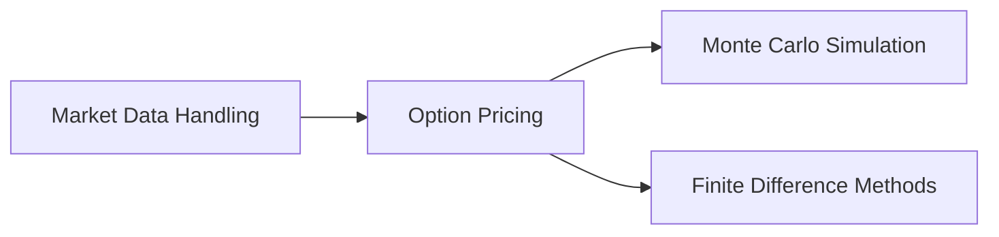

# 📈 Turbo Options: High-Frequency Options Pricing Engine

Welcome to the **High-Frequency Options Pricing Engine**! This project is designed to provide a comprehensive and efficient solution for pricing options using various models, including Monte Carlo simulation and Finite Difference Methods (FDM).

## 🌟 Key Features

- **Option Pricing Models**: Implements Monte Carlo simulation and Finite Difference Methods (FDM) for accurate options pricing.
- **Market Data Handling**: Efficiently fetches and updates market data required for pricing.
- **Math Utilities**: Provides essential mathematical functions for financial calculations.
- **Unit Testing**: Includes a simple test framework to verify the correctness of the `Option` class.

## 🔧 Under the Hood



1. **Market Data Handling**: Fetches and updates market data, including underlying prices, interest rates, dividend yields, and implied volatilities.
2. **Option Pricing**: Prices options using Monte Carlo simulation and Finite Difference Methods (FDM).
3. **Monte Carlo Simulation**: Simulates many random paths for the underlying asset price, calculates the option payoff for each path, and takes the average.
4. **Finite Difference Methods**: Solves the Black-Scholes PDE using numerical methods to get the option price at each point in a grid.

## 🚀 Getting Started

Before getting started, please ensure you have the following:

- A C++ compiler (I tested with `g++`)
- CMake for building Google Test (if you want to use it)
- Basic understanding of options pricing and financial models

### 📥 Installation

Follow these steps to set up the project:

```bash
# Clone the repository
git clone https://github.com/yourusername/OptionsPricingEngine.git

# Navigate to the project directory
cd OptionsPricingEngine

# Create the bin directory for output binaries
mkdir -p bin

# Build the project
make
```

### 🔑 Market Data

The project requires market data to function properly. Create a `data/market_data.txt` file with the necessary market data:

```plaintext
interestRate 0.02
dividendYield 0.00
AAPL 150.0
volatility_AAPL 0.30
```

### 🎯 Usage

To run the options pricing engine, create an `options.txt` file with the options to be priced:

```plaintext
AAPL 155 1672531199 call
AAPL 145 1672531199 put
```

Run the executable with the `options.txt` file as an argument:

```bash
./bin/pricer data/options.txt
```

### 📊 Results

The output will display the prices of the options using different models:

```plaintext
Option: AAPL, Strike=155, Expiry=1672531199
Monte Carlo price: $4.12
FDM price: $4.09
Black-Scholes PDE price: $4.10
Option: AAPL, Strike=145, Expiry=1672531199
Monte Carlo price: $4.12
FDM price: $4.09
Black-Scholes PDE price: $4.10
```

### 🧪 Testing

To run the tests, build the test executable and run it:

```bash
make
./bin/test_option
```

The output will display the results of the tests:

```plaintext
Testing Intrinsic Value:
Call Option (160): Expected 10, Got 10
Call Option (140): Expected 0, Got 0
Put Option (140): Expected 10, Got 10
Put Option (160): Expected 0, Got 0
Testing Time Value:
Call Option: Expected 10, Got 10
Put Option: Expected 10, Got 10
```

### 🔮 Future Enhancements

- [ ] Automated market/options data scraping and sourcing pipeline
- [ ] Usage of GPU and parallelization, `Boost.Math` and `Eigen`
- [ ] Integration of additional pricing models

---

_options pricing is kind of fun! 🚀_